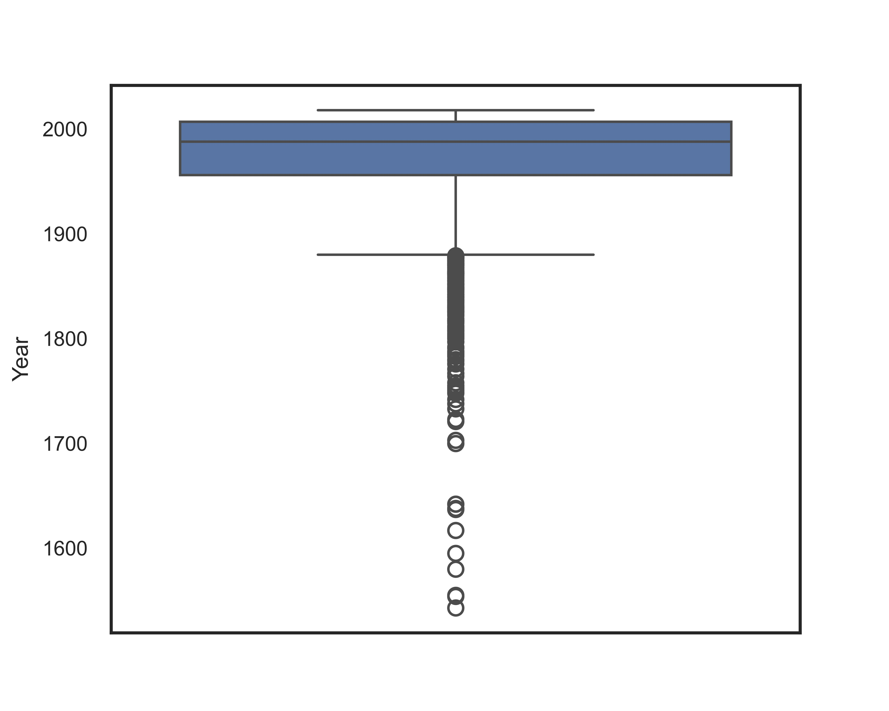
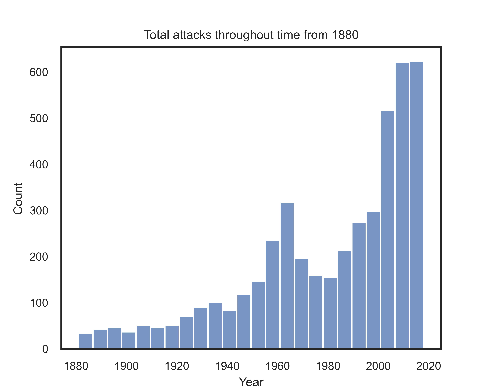
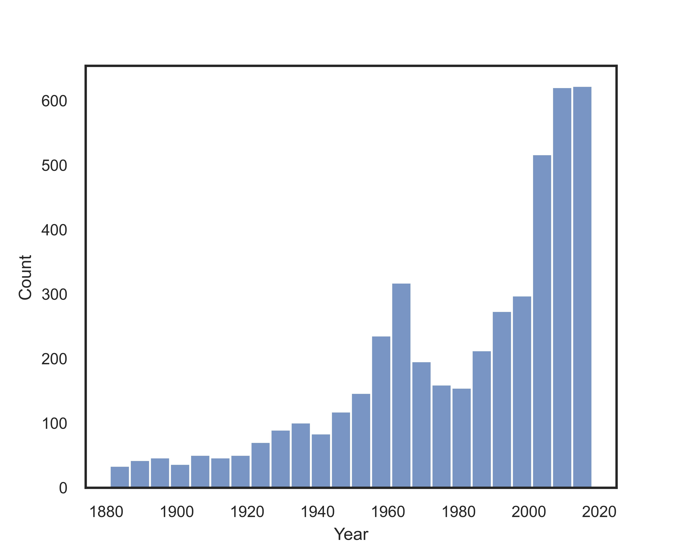
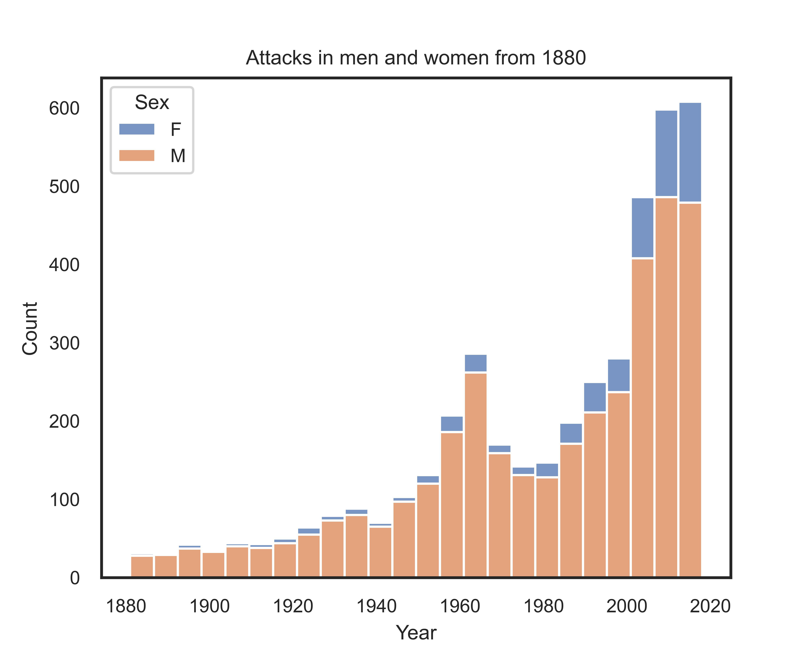
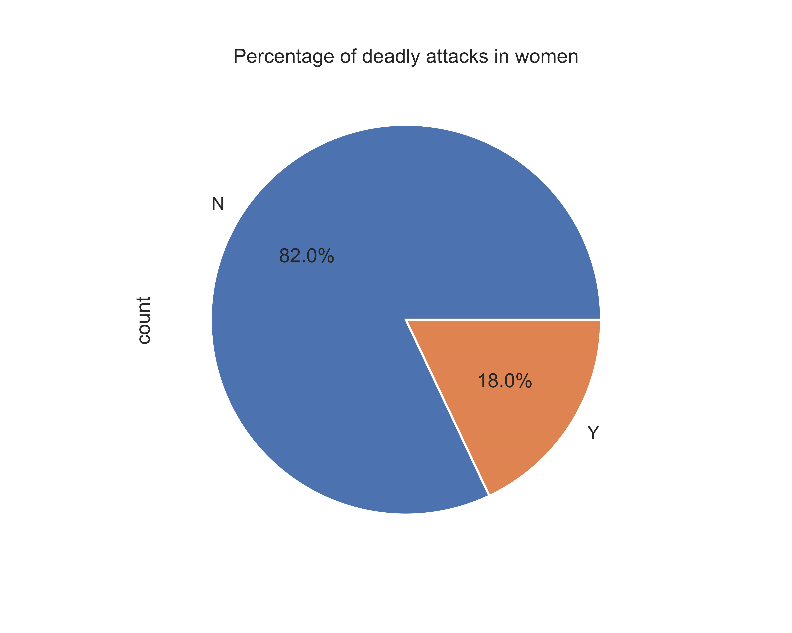
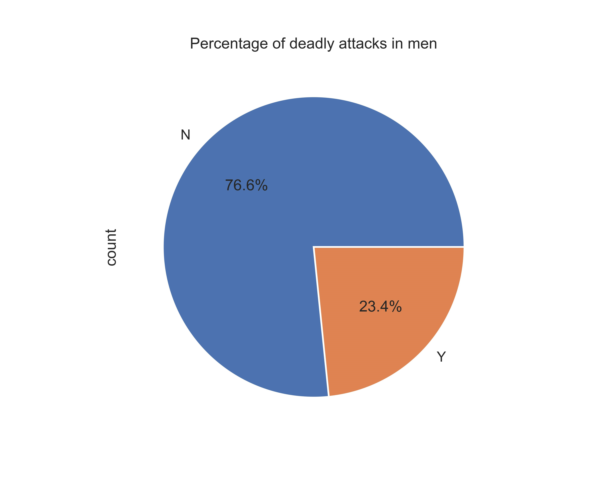
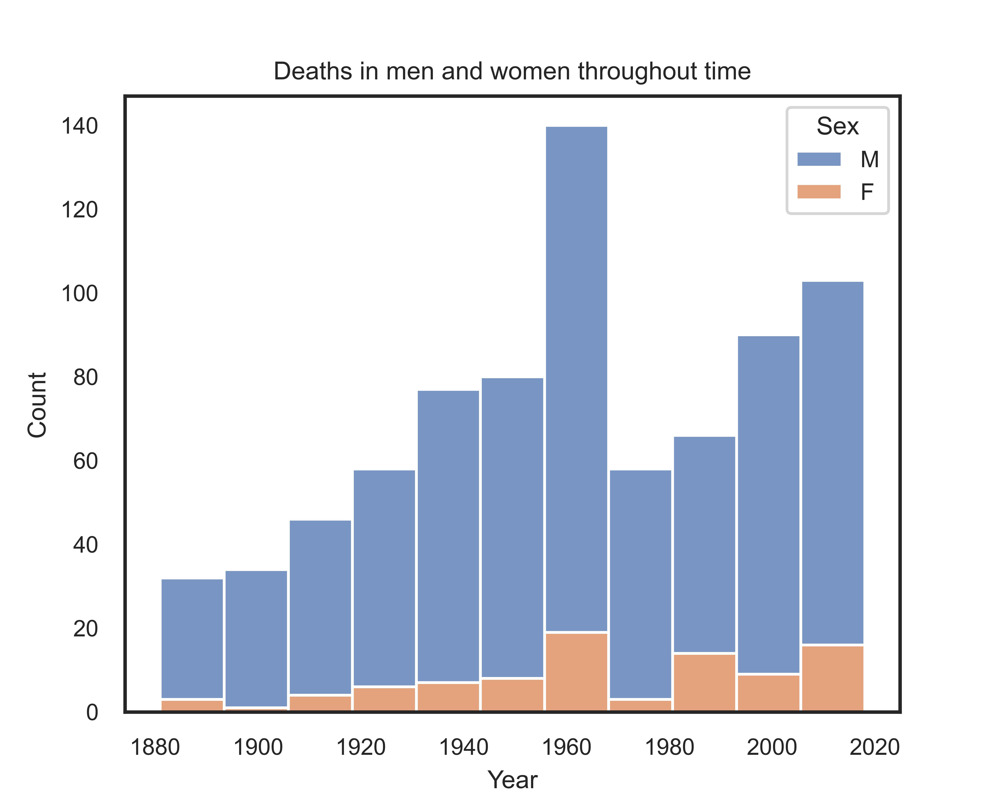
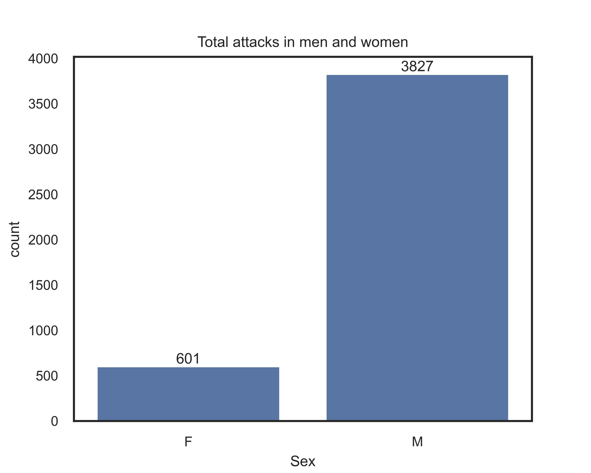
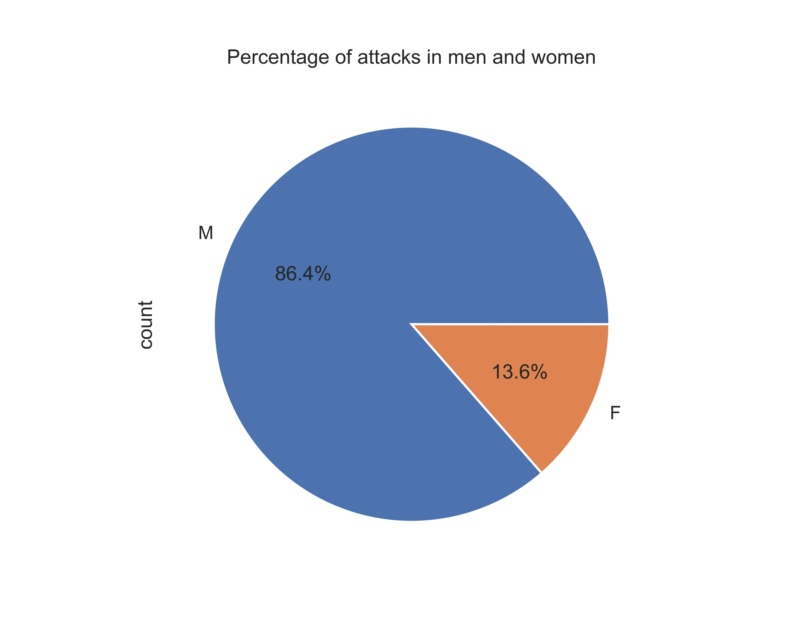
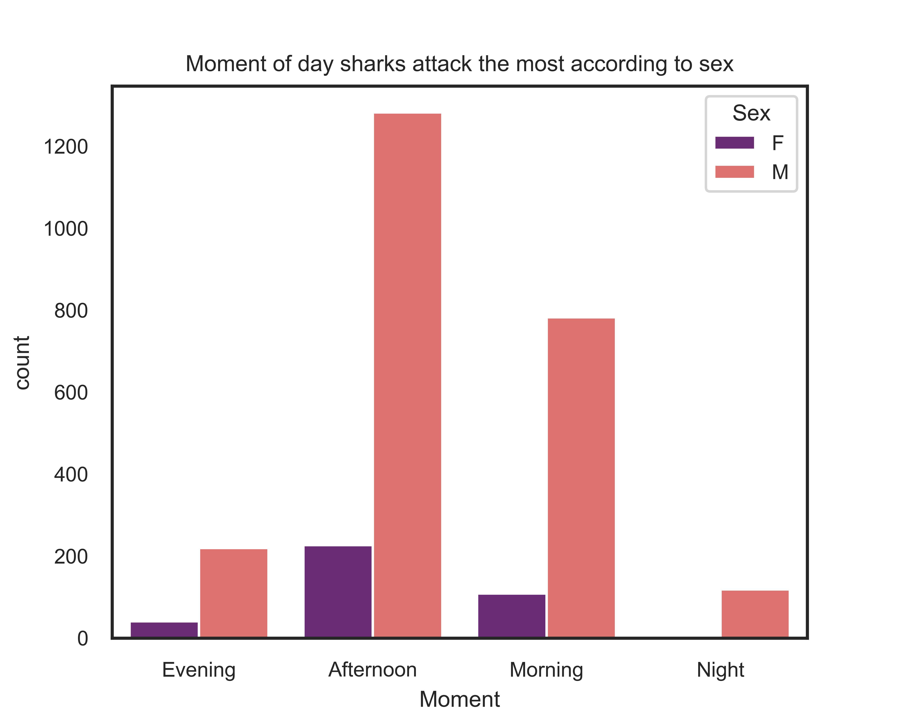

# Project-I

## Overview

The aim of this project is to clean dataset containing information about shark attacks, and visualise data to support my hypotheses.

Link to the presentation: 
https://www.canva.com/design/DAFyHSGNWQs/ZD9mJikMw2KxSu16btg-rw/edit?utm_content=DAFyHSGNWQs&utm_campaign=designshare&utm_medium=link2&utm_source=sharebutton

## Libraries Used:
This code was written in Python/Jupyter Notebook, using the following libraries:
- Pandas
- matplotlib.pyplot
- Seaborn
- os

## Research questions:
- Shark related attacks according to sex.
    - Shark related attacks according to sex, throughout history
- Shark related deaths according to sex.
    - Shark related deaths according to sex, throughout history
- Young sailors: Shark related child deaths according to sex throughout history
- What is a shark's favourite meal?

## Hypotheses:
- Men suffer more shark attacks throughout time
- Men suffer more deadly shark attacks throughout time
- Girls and boys suffer similar shark attacks and related deaths.
- Sharks prefer to attack in the morning

## Shark attacks throughout time:
First of all, before considering shark attacks by sex or age, we take a look at the total of shark encounters, fatal or not, from the considered registries.

As we can see, the events happen mostly between the end of the XIX century and the present.
That's the reason we are going to focus on the mishaps taking place in this period, unless otherwise especified.

In the next chart, we can see that the total amount of shark attacks increases over time, and presents two peaks during its progression, one the 60's and other one in the present time.

## A gender issue: Shark attacks throughout time by sex
There are overwhemingly more men who suffer shark attacks than women. 86,4% of all the attacks ever recorded have occured to a man.

We can appreciate the spike of attacks in the 60's affecting mainly men, while the spike taking place in present time shows a progressive implication in this tragedy of the female gender.

### Men suffer more deadly shark attacks throughout time
Not only men suffer more from shark attacks, but their attacks are more deadly, as shown in the following charts.

23,4% of the attacks suffered by men are deadly, while 18,0% of the attacks suffered by women are. This difference is yet to be analysed to know if it's statistically significant.

In this image we can appreciate the peak in deaths happening in the 60's spike of shark attacks.

### Girls and boys involved in shark attacks and related deaths
We can appreciate differences between men and women, but we cannot conclude that these differences stay the same during a life time. Reckless behaivour might be a gender issue, but it can be allocated within the adult population. 

To know if there are differences between boys and girls before toxic masculinity throws males into the sharks' arms, we look at the evolutions of attacks in children by sex.

We can see that there exist a progression of attacks in girls since 2000, but still not able to reach the number of attacks suffered by boys.

As for deadly attacks, we can see the spike of deaths in children during the 60's decade, proporcionately affecting girls more.

### Age of children dying from shark attacks
The following graph suggest that toddlers are not usually victims of deadly shark attacks, but the spike in the 60's seems to also have involved the death of very young kids.

This is more clear after recategorising the age of the children.

## Sharks' favourite lunch
For sharks, breakfast is not the most important meal of the day, lunch is. Most of the shark attacks take place duering the afternoon, followed by morning

Sharks don't seem to have a prefered gender for each meal.

## In Conclusion
The 60's was the golden age of sharks.

Men are more likely to be attacked by a shark, and also die from it.

The progression in women attacks during present times, as women reclaim their place in the seas, suggests possible trend changes in the future.

Boys are more prone to suffer from shark attacks than girls, but as girls also reclaim their place in the seas, it is possible to find trend changes in the future.

Sharks are not early birds. They enjoy a long night of sleep, and a lunch under the sun.